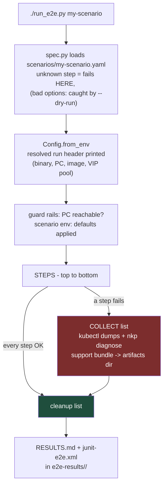
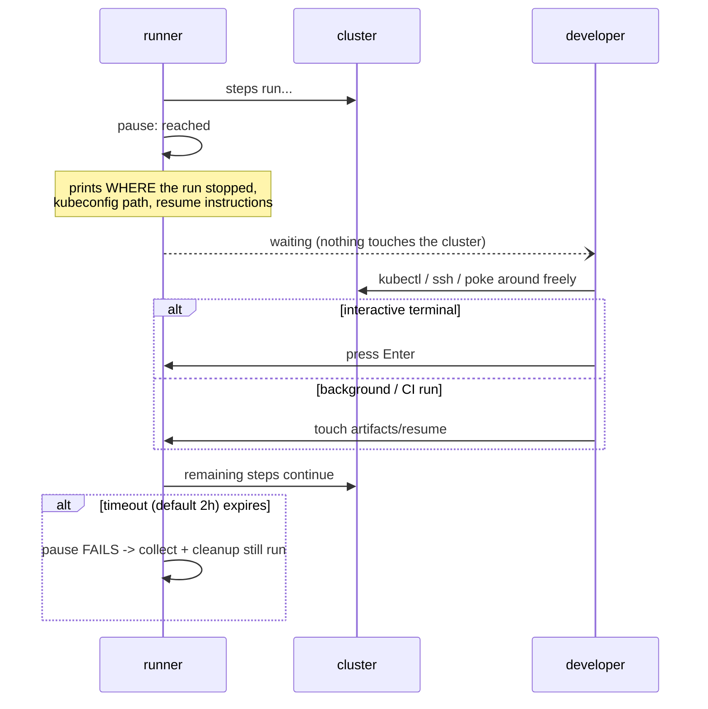

# How a test run works — architecture, failure path, pause

## The run lifecycle




Three lists, three guarantees:

1. **steps** stop at the first failure — nothing after a broken step can be
  trusted, so nothing after it runs.
2. **collect** runs only on failure (or always, with `--always-collect`)
3. **cleanup** always runs — pass or fail, the cluster and its VMs go away
  (or, for `finish_cluster`, get frozen). Every cleanup step is  
   best-effort: one failing cleanup step logs and continues instead of  
   aborting the rest. `--keep` skips cleanup when you want the failure live.

## What a failure leaves you

```
e2e-results/20260827-091428/
├── RESULTS.md                       <- table: scenario, verdict, duration
├── junit-e2e.xml                    <- CI-consumable
├── run.log
└── smart-sanity/
    ├── scenario.log                 <- every command, redacted, timestamped
    ├── claim-....log                <- long subprocess logs, one file each
    └── diagnostics-failure/
        ├── nodes.txt, pods-all.txt, events.txt, helmreleases.txt ...
        └── support-bundle-....tar.gz   <- nkp diagnose, openable locally
```

## The pause step




Why the timeout fails instead of resuming: a forgotten pause must not leak a
cluster overnight on the shared PE. Failing routes the run through the normal
collect + cleanup path, so even the forgotten case ends with a support bundle
and zero debris.

