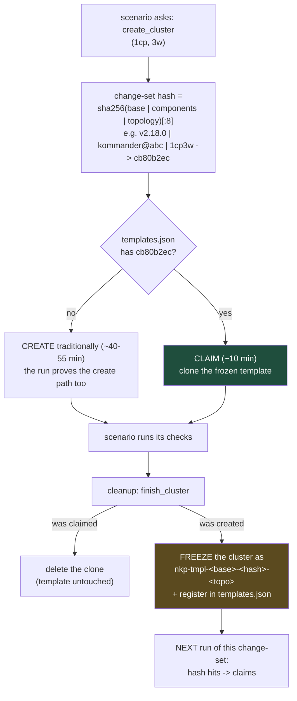
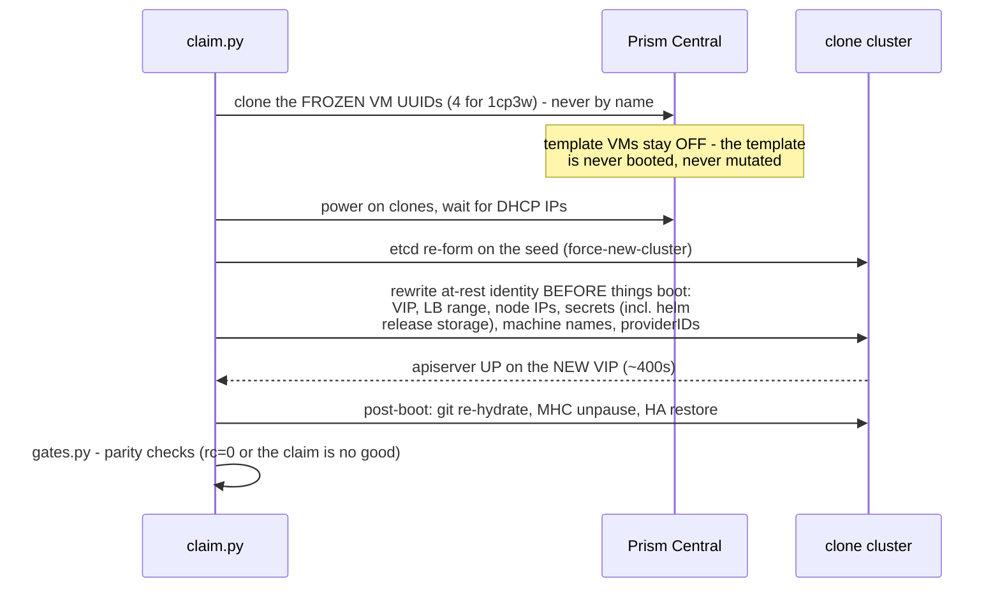

# Why the second scenario is 4-5x faster than the first

The first scenario for a change-set pays for a real cluster build
(~40-55 min). Every scenario after it — same change-set — gets a cluster in
~10 minutes. This doc explains the machinery and the reasoning.

## The decision, made by `create_cluster`

Why hash these three things and nothing else:

- **base version** — a v2.17 cluster is not a v2.18 cluster.
- **components** (`repo@sha` overrides) — a cluster carrying your kommander
  branch is not a vanilla one; two branches are not each other.
- **topology** — a frozen template's node count is *fixed*: a claim clones
  exactly the frozen VMs, and a 3CP claim even re-forms etcd differently. A
  3cp scenario must never claim a 1cp template, so topology is part of the
  identity, and the template name carries it (`...-1cp3w`).

Anything NOT in the hash (scenario name, VIP, cluster name) is
claim-time-changeable, which is precisely what the claim machinery rewrites.

Why freeze in cleanup and not "async during the run": freezing requires
quiescing and powering the cluster OFF — you cannot freeze a cluster while a
scenario is still asserting against it. "Async" here means *async to the
developer*: their verdict is already in RESULTS.md when the freeze starts.

## What a claim actually does (~6-7 min window + gates)

The hard-won parts (each was a real incident, now encoded in the pipeline):

- **Clone by frozen UUID, never by VM name** — duplicate-name VMs once
  poisoned a template; the freeze manifest records exactly which VMs are the
  cluster.
- **Identity is rewritten at rest**, before first boot, byte-for-byte
  (same-length VIP/LB strings) — including inside base64+gzip helm release
  storage and encrypted-at-rest secrets. Anything missed boots pointing at
  the template's addresses; the sweep list is the product of finding every
  such carrier once.
- **A frozen cluster must be dead** — freeze gates verify the template
  powered off and its identity is consistent, because a half-alive template
  serves stale state to its clones.
- **Gates, not vibes** — a claim is only handed to the scenario after
  parity gates pass (nodes, machines, providerIDs, apps reconciled).

## Why clone-a-template instead of just creating faster?

We measured the create path: the floor for a live install is ~25-30 min
(kommander platform convergence dominates at ~60% of wall time, and it is
serial by nature). Cloning sidesteps it: the expensive convergence happened
once, at template-build time; a claim only pays for boot + re-identity.
Concurrency is safe — N claims clone the same OFF template VMs
simultaneously (proven with concurrent claims sharing one template), each
with disjoint VIP/LB/VMs — which is exactly the QA fan-out pattern.

## The numbers (measured on the dev PC)

| path | time | proven |
|---|---|---|
| traditional create + platform | ~40-55 min | every "first run of a change-set" |
| freeze (once per change-set) | ~6 min | template build runs |
| claim window (clone -> apiserver on new VIP) | ~6-7 min | repeatedly, incl. today |
| claim + gates + scenario-ready | ~10-15 min | claim-sanity: 23 min END-TO-END = claim 7 + gates/health 8 + teardown 8 |
