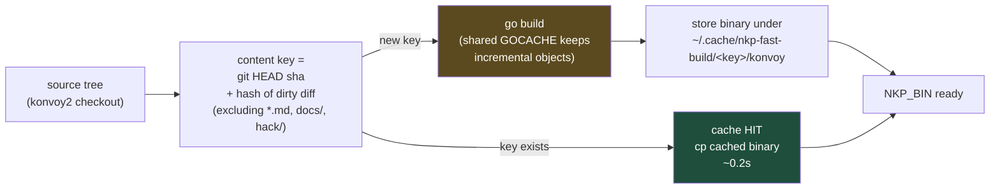
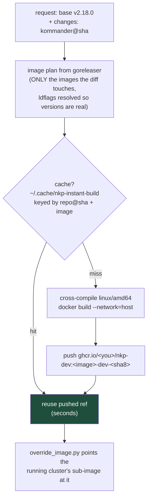

# How the NKP binary build got fast

Two caches, two jobs: the **CLI cache** makes `nkp` itself cheap to rebuild;
the **image/artifact cache** makes controller changes cheap to deliver. They
are separate because their contents have different lifetimes and different
consumers.

## 1. The CLI build — `build-nkp-fast.sh`

Measured: **0.23s** cache hit · **~61s** incremental rebuild (one changed
package, warm GOCACHE) · **~313s** cold build.

The design decisions, and why:

- **Content-addressed, not time-based.** The key is `HEAD` + a hash of
  `git diff HEAD` — the binary is a pure function of the source, so the same
  source can never build twice. Branch switches back and forth are free.
- **Docs excluded from the key** (`*.md`, `docs/`, `hack/`): editing a README
  or an e2e scenario must not invalidate a binary that cannot contain them.
- **The dirty diff is IN the key**: uncommitted work builds correctly — the
  common dev state — while still caching. A time- or branch-keyed cache would
  serve you a stale binary exactly when you are iterating.
- **Go's default persistent build cache underneath** keeps the 60s
  incremental path honest; misses only pay for what changed. The script
  shields the build from a poisoned shell (`env -u GOROOT` — a live-caught
  landmine) and needs `devbox` on PATH.

## 2. Delivering controller changes — the instant-build pipeline cache

A CLI rebuild only carries **konvoy2** changes. A kommander / kapps / CAREN
change is an *image or chart*, delivered by the orchestrator
(`nkp-instant-build/`) into a claimed cluster:

Decisions, and why:

- **Build only the touched images.** The plan is parsed from each repo's
  goreleaser config, so a one-controller change builds one image, not the
  world.
- **The registry IS the cache.** Tags are content-addressed
  (`<image>-dev-<sha8>`), so a pushed ref is durable proof that sha was
  built; the local cache just remembers the mapping. Cache hits cost a
  manifest check.
- **One ghcr package, sha in the tag** (`nkp-dev:<image>-dev-<sha8>`):
  GitHub has no API for package visibility, so the naming scheme is what
  reduces "make it pullable" to a single one-time UI flip. Public package =
  cluster nodes pull anonymously = no imagePullSecrets to inject.
- **Per-developer namespace** (`ghcr.io/<you>/`): no collisions, no shared
  credential, each developer's images are their own.

## What this means end-to-end

| change lives in | rebuild cost after first build | delivered by |
|---|---|---|
| konvoy2 (CLI, CAPI templates) | 0.2s hit / ~61s incremental | `NKP_BIN` used by scenarios |
| kommander / kapps controllers | seconds (cache hit) or one image build | image override into a claimed cluster |
| kommander-applications (charts) | chart vector, cached the same way | git-push into the cluster's flux repo (~18s to in-cluster) |

The caches compose with the claim model (see CLAIM-SPEEDUP.md): the
expensive things — full platform builds — happen once per change-set, and
everything after that is cache hits and clones.
